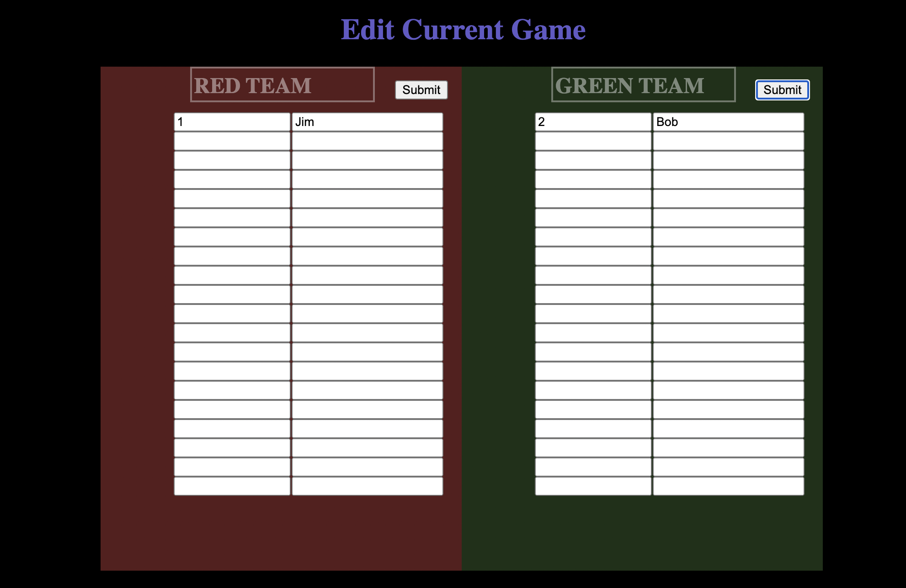

# 
 Sprint 4

### Team 1  Members
1. Jose Martinez 
2. Carson Reed
3. Diego Castro
4. Alexis Mercado
5. Steve Liang

### Github repo link
https://github.com/SE-Team1-F21/Software-Engineering-Team-1-Project

### Set up instructions
>Instructions for installing and compiling the project is the same as previous sprints.

`python_trafficgenerator.py` is the python file contains the sender, which sends the network packets to `python_udpserver.py` acts as the udp server that listens for receiver and gets the data generated by the by the traffic generator

### Screenshots
**
 Player Entry**

**
 Preparation Phase-playAction**

**In Game Phase Point Deductions -playAction**

**In Game Phase II- game continued**

**Game over phase**
