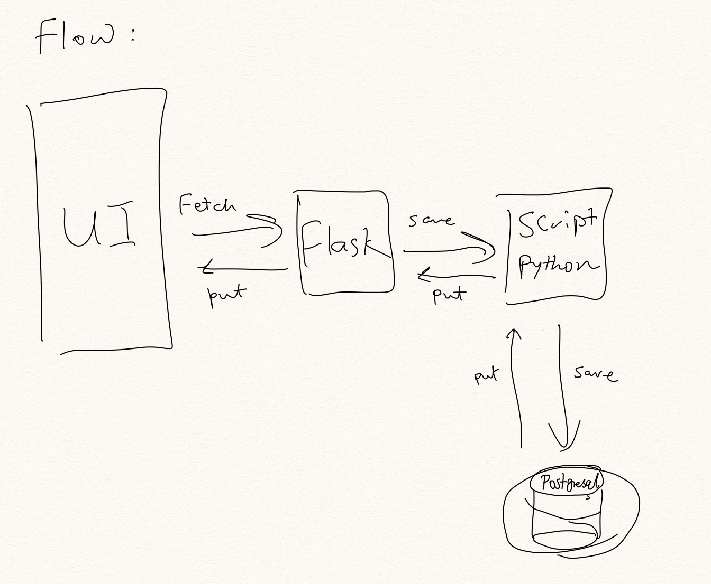

# Software-Engineering-Team-1-Project

## Team Members and their roles
1. Jose Martinez - Free
1. Carson Reed - Front-end
1. Diego Castro - Front-end
1. Alex Mercado - Back-end
1. Steve Liang - Back-end


# Sprint I
### Front-end
Splash screen and player menu implementation, where each (for now) is contained within two html files.
>splash.html for splash

>game.html for game menu

Not final. Feel free to add more files if you need to. Just providing a base line

These files are contained within the "templates" folder. This is necessary for communicating with flask for the backend

The form "submit" button in `splash.html` should generate the `game.html` page.

### Instructions for running Flask
1. Install flask if it's not already installed 
   ```
   pip3 install Flask
   ```
2. Terminal commands for getting flask to run
   ```
   export FLASK_APP=main
   flask run
   ```
   


### Back-end

##### Storing Data
1. Receive input from frontend
1. Flask processing data and pass to **psycopg2**
1. Store in database

##### Fetching Data
1. Using Python library **psycopg2** to fetch data from database
1. Store fetched data into list
1. Pass data in Flask and rendering data to frontend

### Connecting Front-end to back-end
CSS needed slight adjustment for flask to generate a dynamic webpage using CSS. According to the documentation, to generate URLs for static files, use the special 'static' endpoint name
```
url_for('static', filename='style.css')
```
The file has to be stored on the filesystem as ```static/style.css```

The authentication views and templates work, but they look very plain right now. Some CSS can be added to add style
to the HTML layout you constructed. The style won’t change, so it’s a static file rather than a template

Flask automatically adds a static view that takes a path relative to the flaskr/static directory and serves it.
The base.html template already has a link to the style.css file:

```
{{ url_for('static', filename='style.css') }}
```
As such the rel attribute for link had to be changed to
```
<link rel="stylesheet" href="{{ url_for('static', filename='style.css') }}">
```
**Though this produced a window size error**


### **middleHandler Usage**
This python script can save and update the postgresql database. This phase, developer will need to manually modify the python code in order to insert the desire {id, codeName} pair to the database.

### **Run Script**
If you are using heroku for database hosting, copy and paste the credential information upon running this script.
```
python middleHandler.py user password host port database
```


### Flow



